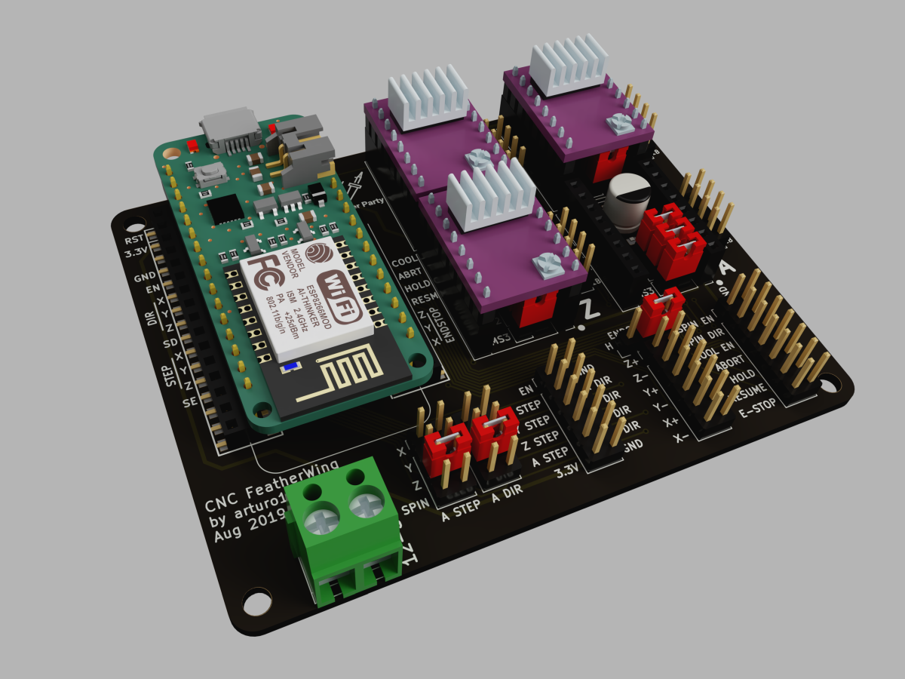
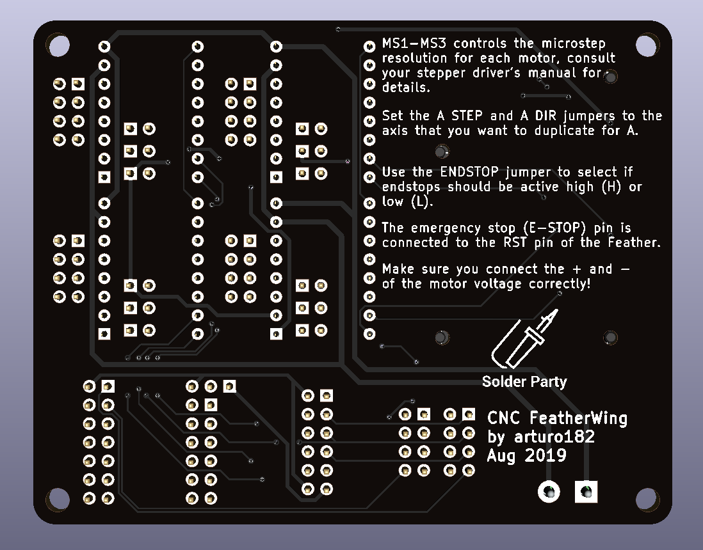
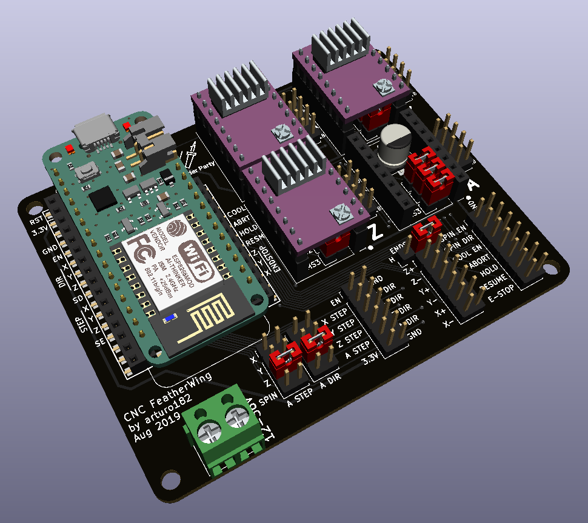

# CNC FeatherWing

Inspired by the Arduino CNC Shield, offers similar functionality. 

Requires a Feather-compatible board.

- 4 slots for Pololu stepper motor drivers, 3 axis + 1 clone axis (configurable via jumpers)
- Endstops for X/Y/Z with selectable active level (high or low)
- Pins for external buttons including emergency stop
- Pins for spindle and collant control
- Configurable microstep resolution via jumpers

